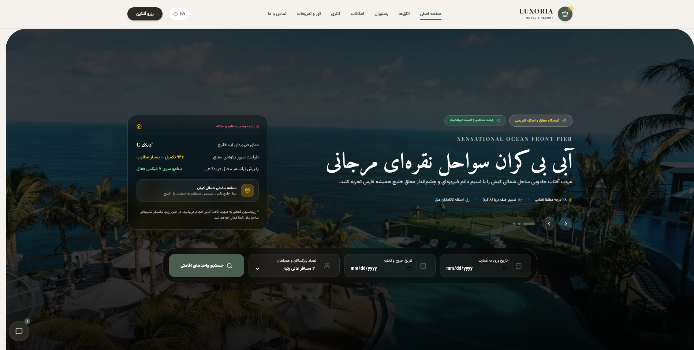
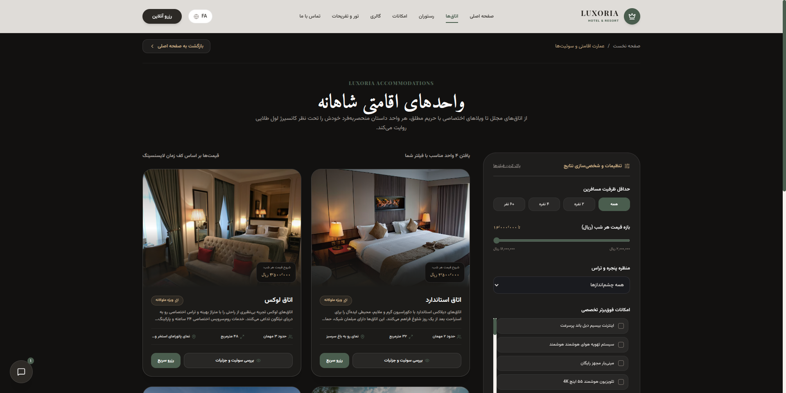
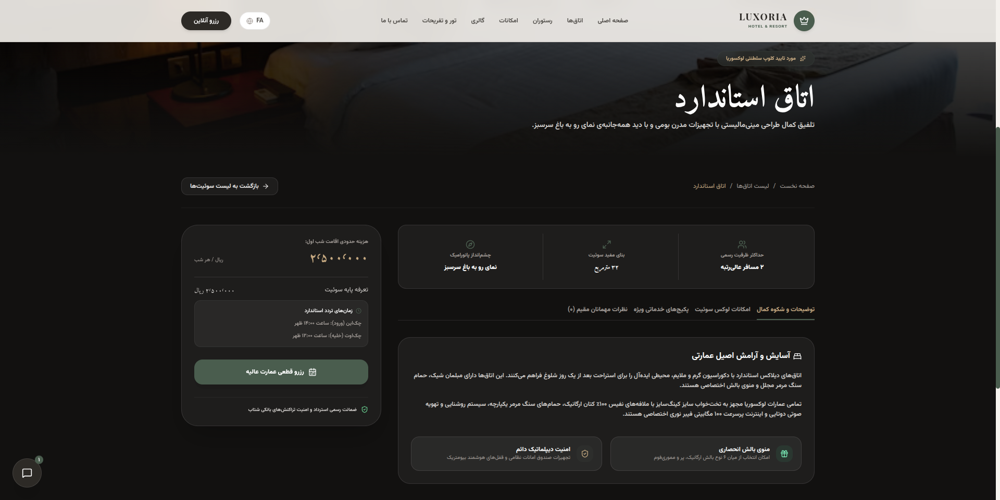
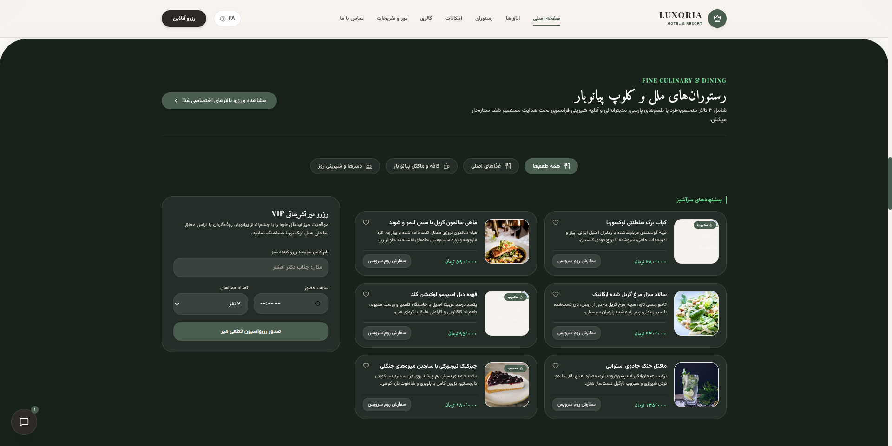
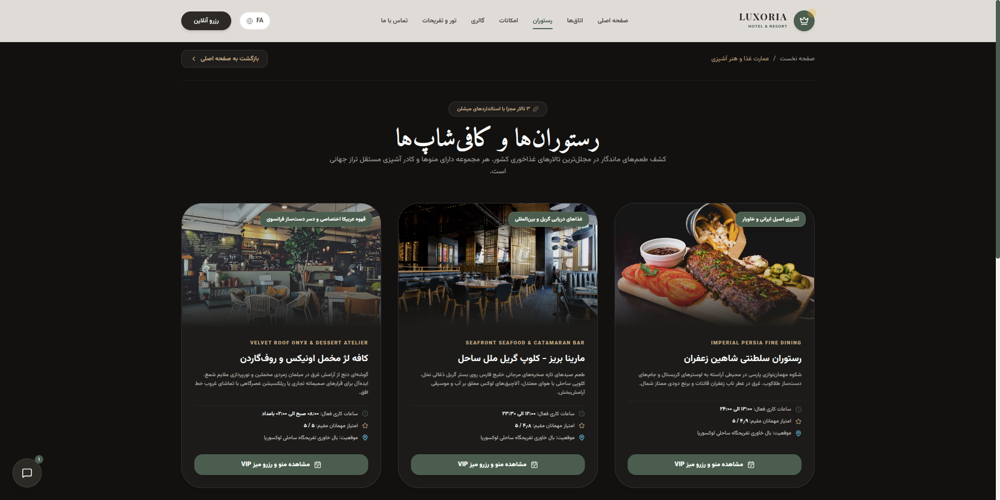

# Luxoria Hotel & Resort

A luxury hotel and resort web application built with React and Vite. Luxoria presents a full-featured digital experience for a five-star beachfront property — including room browsing, online booking, fine dining, amenities, gallery, tours, guest reviews, and a smart concierge chat widget. The UI is designed in Persian (RTL) with an elegant, premium aesthetic.

**Live demo:** [View/](https://code1sprint.github.io/Luxoria-Hotel/)

---

## Overview

Luxoria Hotel & Resort is a single-page application (SPA) that simulates the website of an international luxury hotel located on Kish Island, Iran. The app uses client-side page routing to navigate between the landing page and dedicated views for rooms, restaurants, and the photo gallery.

Key characteristics:

- **RTL-first design** — Persian language content with right-to-left layout
- **Stacking scroll effect** — Landing page sections use sticky stacking with 3D scale and fade animations
- **Multi-step booking flow** — A modal wizard handles date selection, guest details, add-ons, and confirmation
- **Rule-based concierge** — Floating chat assistant "Kian" answers common questions about rooms, spa, dining, and tours
- **Static data layer** — Room, amenity, menu, tour, and review data live in a centralized TypeScript module

---

## Screenshots

### Home — Hero and Booking Search

The landing page hero features a rotating carousel of resort scenes, live climate status, and an integrated search bar for check-in, check-out, and guest count.



### Rooms — List with Filters

Browse all accommodation units with sidebar filters for capacity, price range, view type, and amenities. Each card supports quick booking or navigation to the detail page.



### Room Detail

Individual room pages show specifications, tabbed content (description, amenities, services, reviews), and a sticky booking sidebar with pricing and reservation CTA.



### Restaurant — Landing Section

The restaurant section on the home page showcases international dining halls, menu categories, chef recommendations, and a VIP table reservation form.



### Restaurant — Outlet List

Dedicated page listing all dining venues with operating hours, guest ratings, locations, and menu/reservation actions.



---

## Features

### Landing Page Sections

| Section | Description |
|---------|-------------|
| **Hero** | Full-screen carousel with search bar, live weather widget, and scene navigation |
| **Amenities** | Six hotel facilities (parking, room service, conference, pool & spa, restaurant, 24h reception) |
| **Rooms** | Preview cards for four room types with book and detail actions |
| **Restaurant** | Menu showcase with category filters and VIP table booking form |
| **Gallery** | Photo gallery of the resort and surroundings |
| **Tours** | Excursion packages (catamaran cruise, desert stargazing) |
| **Reviews** | Guest testimonials with star ratings |
| **Contact** | Location map, phone, email, and contact form |

### Dedicated Pages

| Page | Route (state) | Description |
|------|---------------|-------------|
| Rooms List | `rooms-list` | Filterable grid of all rooms |
| Room Detail | `room-detail` | Full room profile with tabs and booking sidebar |
| Gallery View | `gallery-view` | Expanded photo gallery |
| Restaurant List | `restaurant-list` | All dining outlets |
| Restaurant Detail | `restaurant-detail` | Individual restaurant menu and info |

### Booking Modal

Three-step reservation wizard:

1. **Dates & Add-ons** — Check-in/out, guest count, optional breakfast, airport transfer, and travel insurance
2. **Guest Information** — Full name, phone, and email
3. **Confirmation** — Booking ID generation and summary

### Smart Concierge (Kian)

A floating chat widget that responds to keyword-based queries about:

- Room types and pricing
- Spa and pool hours
- Airport transfer services
- Restaurant menu and prices
- Check-in / check-out times
- Tour packages

Quick-prompt buttons are provided for common questions.

### Navigation

- Sticky navbar with scroll-spy active section highlighting
- Mobile-responsive hamburger menu
- Language switcher UI (FA / EN placeholder)
- "Online Reservation" CTA button

---

## Tech Stack

| Category | Technology |
|----------|------------|
| Framework | React 19 |
| Build Tool | Vite 6 |
| Language | TypeScript 5.8 |
| Styling | Tailwind CSS 4 |
| Animations | Motion (Framer Motion) |
| Icons | Lucide React |
| Deployment | GitHub Pages (GitHub Actions) |

---

## Project Structure

```
Luxoria-Hotel/
├── .github/workflows/
│   └── deploy.yml              # GitHub Pages CI/CD pipeline
├── docs/screenshots/           # README screenshots
├── src/
│   ├── App.tsx                 # Root component, routing, layout
│   ├── main.tsx                # Application entry point
│   ├── index.css               # Global styles and Tailwind imports
│   ├── types.ts                # Shared TypeScript interfaces
│   ├── data/
│   │   └── hotelData.ts        # Rooms, amenities, menu, tours, reviews
│   ├── components/
│   │   ├── Navbar.tsx          # Top navigation bar
│   │   ├── Hero.tsx            # Hero carousel and search
│   │   ├── Amenities.tsx       # Facilities section
│   │   ├── RoomsSection.tsx    # Room preview cards
│   │   ├── RoomsListPage.tsx   # Full rooms listing
│   │   ├── SingleRoomPage.tsx  # Room detail page
│   │   ├── RestaurantSection.tsx
│   │   ├── RestaurantListPage.tsx
│   │   ├── SingleRestaurantPage.tsx
│   │   ├── GallerySection.tsx
│   │   ├── GalleryViewPage.tsx
│   │   ├── ToursSection.tsx
│   │   ├── ReviewsSection.tsx
│   │   ├── ContactSection.tsx
│   │   ├── BookingModal.tsx    # Multi-step booking wizard
│   │   ├── SmartConcierge.tsx  # Chat assistant widget
│   │   └── StackingSectionWrapper.tsx  # Scroll stacking animation
│   └── assets/images/          # Project screenshots and assets
├── index.html
├── vite.config.ts
├── tsconfig.json
├── package.json
└── .env.example
```

---

## Getting Started

### Prerequisites

- [Node.js](https://nodejs.org/) 18 or later (Node 22 recommended for CI parity)
- npm

### Installation

```bash
git clone https://github.com/code1sprint/Luxoria-Hotel.git
cd Luxoria-Hotel
npm install
```

### Development

```bash
npm run dev
```

The dev server starts at [http://localhost:3000](http://localhost:3000).

### Production Build

```bash
npm run build
npm run preview
```

Built output is written to the `dist/` directory.

---

## Environment Variables

Copy `.env.example` to `.env` if you extend the project with backend or AI integrations:

```env
GEMINI_API_KEY="MY_GEMINI_API_KEY"
APP_URL="MY_APP_URL"
```

These variables are part of the Google AI Studio template scaffolding. The current frontend concierge uses local keyword matching and does not require a Gemini API key to run.

---

## Available Scripts

| Command | Description |
|---------|-------------|
| `npm run dev` | Start Vite dev server on port 3000 |
| `npm run build` | Build for production |
| `npm run preview` | Preview the production build locally |
| `npm run lint` | Run TypeScript type checking (`tsc --noEmit`) |
| `npm run clean` | Remove `dist/` and `server.js` |

---

## Deployment

The project is configured for automatic deployment to GitHub Pages on every push to the `main` branch.

The workflow (`.github/workflows/deploy.yml`):

1. Installs dependencies with `npm ci`
2. Builds with `GITHUB_PAGES=true` to set the correct base path (`/Luxoria-Hotel/`)
3. Uploads the `dist/` artifact and deploys via GitHub Pages

To deploy manually, trigger the workflow from the **Actions** tab using **workflow_dispatch**.

---

## Pages and Sections

### Room Types

| Room | Capacity | Size | Starting Price (Toman/night) |
|------|----------|------|------------------------------|
| Standard Room | 2 | 32 m² | 2,500,000 |
| Luxury Room | 3 | 48 m² | 4,500,000 |
| Royal Suite | 4 | 85 m² | 8,500,000 |
| Private Villa | 6 | 210 m² | 15,000,000 |

### Dining Outlets

- **Imperial Persia Fine Dining** — Authentic Persian cuisine
- **Seafront Seafood & Catamaran Bar** — Fresh Gulf seafood
- **Velvet Roof Onyx & Dessert Atelier** — Rooftop cafe and desserts

### Tour Packages

- Catamaran cruise with snorkeling (5 hours)
- Desert stargazing and off-road adventure (overnight)

---

## Design Highlights

- **Color palette** — Warm neutrals (`#F5F2EE`, `#FBFAF5`) with deep charcoal (`#2D2A26`) and forest green accents (`#4A5D4E`)
- **Typography** — Serif titles paired with clean sans-serif body text
- **Stacking scroll** — `StackingSectionWrapper` uses Motion's `useScroll` and `useTransform` for sticky sections that scale down and fade as the next section scrolls over
- **Motion animations** — Page transitions, modal steps, chat panel, and hero carousel powered by Motion
- **Responsive layout** — Mobile-first with collapsible navigation and adaptive grids

---

## Data Model

Core interfaces are defined in `src/types.ts`:

- `Room` — Accommodation unit with pricing, capacity, amenities, and description
- `AmenityItem` — Hotel facility with icon and detail list
- `MenuItem` — Restaurant dish with category, price, and image
- `TourItem` — Excursion package with duration and highlights
- `Review` — Guest review with rating and room type
- `BookingDetails` — Reservation form data shape

All sample data is centralized in `src/data/hotelData.ts` for easy customization.

---

## License

This project is licensed under the [Apache License 2.0](https://www.apache.org/licenses/LICENSE-2.0).
